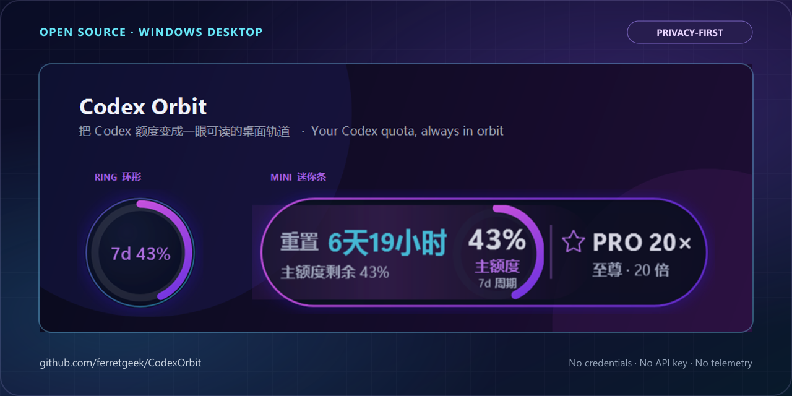

# Codex Orbit

[简体中文](README.md)

Codex Orbit is a lightweight Windows desktop widget for the primary Codex
quota included with a ChatGPT plan. It uses an installed Codex App Server for
live data, safely merges sparse rate-limit notifications, polls as a safety
net, and can fall back to recent local session snapshots.

> [!IMPORTANT]
> This is an unofficial community project. It is not affiliated with, endorsed
> by, sponsored by, or officially supported by OpenAI. It displays
> ChatGPT-plan Codex quota—not OpenAI API billing or API rate limits—and never
> bypasses usage limits.

[](https://github.com/ferretgeek/CodexOrbit/releases/latest)

## Highlights

- Live primary-quota updates through `account/rateLimits/updated`, including
  sparse payloads in the current App Server protocol.
- Automatic runtime discovery for Codex App, Codex CLI, PATH, common IDE
  extensions, installed Windows packages, and WSL.
- No need to start App or CLI first: Codex Orbit launches a hidden local
  `codex app-server` child process when required.
- Mini bar, resizable ring, or both; six global themes—including Sakura and Mint light palettes—opacity, topmost,
  click-through, edge docking, and fullscreen suppression.
- Remaining percentage, reset countdown, plan badge, low-quota notifications,
  and quota-reset notifications.
- Primary-limit selection prevents model-specific buckets such as Spark from
  replacing the main quota.
- No project telemetry, no direct credential reads, no API key setup, and no
  runtime NuGet dependencies.

## Requirements

- Windows 10/11 x64.
- .NET Framework 4.8.
- At least one available Codex runtime:
  - Codex Windows App;
  - Codex CLI;
  - a supported VS Code/Cursor/Windsurf extension containing Codex;
  - Codex CLI in WSL.
- Codex signed in with a ChatGPT account. API-key authentication can access the
  API, but does not expose ChatGPT-plan quota.

See the official
[Codex authentication documentation](https://learn.chatgpt.com/docs/auth),
[App Server documentation](https://learn.chatgpt.com/docs/app-server), and
[usage documentation](https://learn.chatgpt.com/docs/pricing).

The upstream App Server interface is evolving. Codex Orbit v3.2.1 is verified
against the App Server schema generated by `codex-cli 0.147.0` and includes a
local-log fallback for temporary incompatibilities.

## Install

### From GitHub Releases

1. Open the repository's [latest Release](https://github.com/ferretgeek/CodexOrbit/releases/latest).
2. Download `CodexOrbit-<version>-windows-x64.exe`, or download the ZIP if you
   also want offline documentation.
3. Verify the file with `SHA256SUMS.txt`.
4. Move the executable to a stable location and run it.
5. Enable **Start with Windows** from the tray menu if desired.

Beginning with v3.2.1, each GitHub Release also has a build-provenance
attestation. If GitHub CLI is installed, verify that a download was produced
by this repository's GitHub Actions workflow:

```powershell
gh attestation verify .\CodexOrbit-<version>-windows-x64.exe `
  --repo ferretgeek/CodexOrbit
```

The community binary is not commercially code-signed. Windows SmartScreen may
show an unknown-publisher prompt on first launch. Verify both the SHA-256 and
provenance before running it. An attestation is not an Authenticode signature
and does not automatically suppress SmartScreen. If the EXE is moved later,
toggle autostart off and on so the saved path is updated.

### Build from source

Open PowerShell in the repository root:

```powershell
.\scripts\build.ps1
```

The output is:

```text
src\CodexOrbit\bin\x64\Release\CodexOrbit.exe
```

You can also open `CodexOrbit.sln` in Visual Studio 2022 and build
`Release | x64`. The application uses only .NET Framework system assemblies.

## Controls

| Input | Action |
| --- | --- |
| Left-drag | Move the widget |
| Right-click | Show details for three seconds |
| Right-click again | Close details immediately |
| `Ctrl + right-click` | Open settings |
| Tray icon right-click | Open settings |
| Tray icon left-click or double-click | Reveal the widget |

When click-through is enabled, use the tray menu to disable it.

## Runtime compatibility

| Environment | Support | Notes |
| --- | --- | --- |
| Codex App installed but closed | Yes | Discovers the installed runtime |
| Codex App running | Yes | Starts an independent service from the same runtime |
| Codex CLI installed but closed | Yes | Discovers npm, local, or PATH installations |
| Supported IDE extension only | Yes | Scans common extension directories |
| WSL Codex CLI only | Yes | WSL runtime must use ChatGPT authentication |
| No App or CLI process running | Yes | An installed runtime is sufficient |
| No runtime and no local snapshot | No | There is no account service or fallback data |
| API-key authentication | No plan quota | The UI reports the authentication mismatch |

## Data and privacy

Live mode communicates with a local `codex app-server` process over redirected
standard input and output. Codex owns authentication and remote requests;
Codex Orbit never reads `.codex\auth.json`.

If the live service is unavailable, the application reads only the tail of
recent JSONL session files to extract `rate_limits`. It does not upload or
persist prompts, responses, or full logs. See [PRIVACY.en.md](PRIVACY.en.md).

The local directory can contain:

```text
%LOCALAPPDATA%\CodexQuota\
├─ settings.json   UI and notification preferences
├─ runtime\         runtime cache prepared from the installed Windows App
└─ error.log        local diagnostics, created only after an unhandled error
```

Diagnostics are never uploaded. Individual entries are length-limited, and
common user paths and token formats are redacted. The file can still contain
exception context, so inspect it before sharing. None of these local files is
included in source or release archives.

## Troubleshooting

### “No usable Codex runtime found”

Confirm Codex App or CLI is installed and opens normally. CLI users can run:

```powershell
codex --version
```

Then choose **Refresh now** from the tray menu.

### “Codex is not signed in to ChatGPT”

Complete ChatGPT sign-in inside Codex App or CLI. Setting `OPENAI_API_KEY` is
not the same as ChatGPT-plan authentication.

### WSL does not show quota

Confirm `codex` is executable and signed in with ChatGPT inside that
distribution. An API-key-only WSL runtime cannot provide plan quota.

### Data is temporarily stale

Notifications update the display immediately. A five-second safety timer
corrects missed events; failed live connections use a 15-second retry backoff
to avoid repeatedly starting broken runtimes. The UI clearly marks local or
reconnecting snapshots as non-live.

### Inspect local diagnostics

After an unhandled error, the application may write:

```text
%LOCALAPPDATA%\CodexQuota\error.log
```

The size is bounded and common path and secret formats are redacted. The file
stays local and is never uploaded automatically. Before attaching any excerpt
to an issue, manually remove prompts, account details, and other identifying
context; never attach an unreviewed complete log.

### Reset all UI settings

Exit the application and delete:

```text
%LOCALAPPDATA%\CodexQuota\settings.json
```

## Development and release

```powershell
# Build and deterministic tests; no real account required
.\scripts\test.ps1

# Optional read-only check against the current signed-in account
.\scripts\test.ps1 -Live

# Build release EXE, ZIP, and SHA-256 checksums
.\scripts\package.ps1
```

The deterministic suite uses a local fake App Server and covers sparse
notifications, account-response minimization, diagnostic redaction,
local-session-log parsing, quota thresholds, plan mapping, reset tracking, and
window placement.

## Documentation

| Topic | English | 简体中文 |
| --- | --- | --- |
| Contributing | [CONTRIBUTING.en.md](CONTRIBUTING.en.md) | [CONTRIBUTING.md](CONTRIBUTING.md) |
| Privacy | [PRIVACY.en.md](PRIVACY.en.md) | [PRIVACY.md](PRIVACY.md) |
| Security | [SECURITY.en.md](SECURITY.en.md) | [SECURITY.md](SECURITY.md) |
| Support | [SUPPORT.en.md](SUPPORT.en.md) | [SUPPORT.md](SUPPORT.md) |
| Architecture | [ARCHITECTURE.en.md](docs/ARCHITECTURE.en.md) | [ARCHITECTURE.md](docs/ARCHITECTURE.md) |
| Publishing | [PUBLISHING.en.md](docs/PUBLISHING.en.md) | [PUBLISHING.md](docs/PUBLISHING.md) |
| Changelog | [CHANGELOG.en.md](CHANGELOG.en.md) | [CHANGELOG.md](CHANGELOG.md) |
| Conduct | [CODE_OF_CONDUCT.en.md](CODE_OF_CONDUCT.en.md) | [CODE_OF_CONDUCT.md](CODE_OF_CONDUCT.md) |

## License

[MIT](LICENSE) · [Chinese reference translation](LICENSE.zh-CN.md)

OpenAI, ChatGPT, and Codex are trademarks of their respective owners. “Codex”
is used only to identify compatibility.
